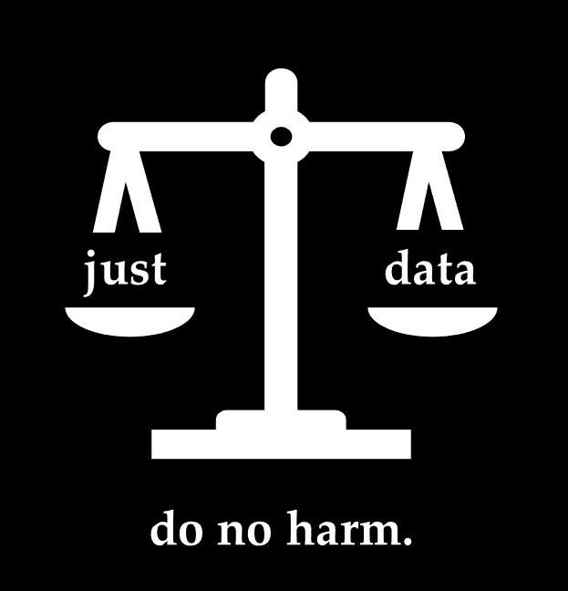

# Just Data
___just data___ is an easy to use and accessible tool to counteract biases in machine learning. It helps users to understand their data and their machine learning model. Future versions will enable users to understand the cause of underlying biases and how to mitigate them.

> Take a look at the presentation of our project during #HerHackaton [here](https://docs.google.com/presentation/d/19n3YCCHYo_L5I6NWru_N_1UXOiQzOQu_ntFsj3xzPuE/edit#slide=id.ge12f623f95_0_45).

## How to execute the app locally
> To run the app locally, we recommend the use of [conda environments]().

Run in your command line terminal the following commands:

```bash
$ git clone 
$ cd {your/path/to/clone}
$ conda create --name "deloitte-challenge" python=3.8
$ conda activate deloitte-challenge
$ pip install -r requirements.txt
$ streamlit run app/demo.py
```

## How to execute the app online
Our app is built using [Streamlit](https://streamlit.io/). To run it in your browser, just press the following badge: [__COMING SOON__]


## How to run the notebooks
- {Binder or google colab}


## Authors
> in alphabetic order
- [Cora Fischer]()
- [Ilkay Isik]()
- [Martina Vilas]()

## Acknowledgements
{description}